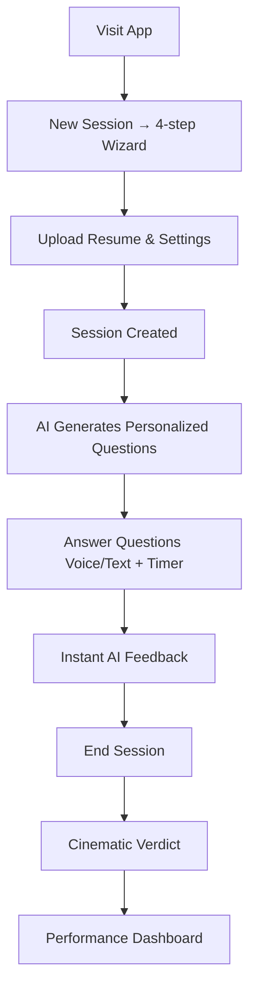

# Intervex — AI-Powered Interview Practice Platform

## Table of Contents
- [Overview](#overview)
- [Features](#features)
- [Tech Stack](#tech-stack)
- [Project Structure](#project-structure)
- [Getting Started](#getting-started)
- [How It Works — User Flow](#how-it-works--user-flow)
- [New Session Wizard](#new-session-wizard)
- [Active Interview Session](#active-interview-session)
- [AI Feedback System](#ai-feedback-system)
- [Resume Upload & Parsing](#resume-upload--parsing)
- [Verdict System](#verdict-system)
- [Performance Dashboard](#performance-dashboard)
- [Badge System](#badge-system)
- [Streak Tracking](#streak-tracking)
- [Drill Mode](#drill-mode)
- [API Reference](#api-reference)
- [Database Schema](#database-schema)
- [Environment Variables](#environment-variables)
- [Architecture Decisions](#architecture-decisions)

---

## Overview
Intervex is a full-stack, AI-powered mock interview practice application that helps candidates prepare for technical and behavioral interviews. Users can practice answering questions by voice or text, receive instant AI-generated feedback on their performance, upload their resume so questions are personalized to their background, and track improvement over time via a performance dashboard with streaks, badges, and score history.

The name **Intervex** captures the idea of being challenged (vex) inside an interview — the app doesn't just throw random questions at you; it simulates a real interviewer who has read your resume and knows what to ask.

---

## Features

### Core Interview Experience
* **Voice or text answers** — speak your answer using the microphone or type it
* **AI-generated personalized questions** — questions are tailored from your resume, target company, and interviewer persona
* **Real-time AI feedback** after every answer covering 6 dimensions
* **Countdown timer** per question (configurable, 30 – 300 seconds) to simulate real pressure
* **Side-by-side comparison** — toggle between your original answer and the AI-improved version
* **Follow-up questions** — each answer generates 3 realistic follow-up questions

### Feedback Dimensions
* **Clarity (0–10)** — structure and coherence of your answer
* **Confidence (0–10)** — assertiveness, ownership, decisiveness
* **Technical Depth (0–10)** — relevance and accuracy of technical content
* **Communication (0–10)** — language quality, storytelling, conciseness
* **STAR Score (0–10)** — adherence to Situation → Task → Action → Result format
* **Tone Analysis** — single-word tone label (confident / nervous / enthusiastic / monotone / uncertain / composed)
* **Filler Word Count** — counts "um", "uh", "like", "you know", "basically", "literally", and 10+ more

### Resume Intelligence
* **Upload PDF or DOCX resume** (up to 10 MB) with drag-and-drop
* **Text extracted server-side** using `pdf-parse` and `mammoth`
* AI reads your resume and asks about specific projects, companies, technologies, and accomplishments
* At least half of generated questions reference something from your resume directly

### Session Customization
* **4-step wizard:** Basics → Resume → Settings → Review
* **12 role presets** + custom role input
* **12 company presets** (Google, Meta, Amazon, Apple, Microsoft, Netflix, Stripe, Airbnb, Uber, Spotify, OpenAI, Other)
* **3 interviewer personas:** Friendly, Tough, Technical
* **Timed Mode** with adjustable per-question countdown
* **Drill Mode** targeting your weakest areas from past sessions
* **Target interview date** with days-remaining countdown

### Verdict System
Session ends with a cinematic animated verdict overlay:
* **Hired** (score ≥ 7.5) — green trophy animation
* **Borderline** (score ≥ 5.5) — amber star animation
* **Not Selected** (score < 5.5) — rose X animation

### Performance Dashboard
* **Streak tracker** with fire emoji and contextual messaging
* **4 stat cards:** total sessions, total questions answered, average overall score, badges earned
* **Skill breakdown gauges** (Clarity / Confidence / Tech Depth / Communication all-time averages)
* **Score history line chart** — overall + clarity + technical depth over time (Recharts)
* **Weak areas horizontal bar chart** — 4 skill categories ranked by average score
* **8 achievement badges** with locked/earned visual states
* **Drill Mode CTA** — appears when a weak area is detected, pre-fills the drill session

---

## Tech Stack

### Frontend (`artifacts/interview-copilot`)
| Technology | Purpose |
| :--- | :--- |
| **React 19** | UI framework |
| **TypeScript** | Type safety |
| **Vite** | Build tool + dev server |
| **Tailwind CSS** | Utility-first styling |
| **Framer Motion** | Animations and page transitions |
| **TanStack Query** | Server state management, caching |
| **Wouter** | Lightweight client-side routing |
| **Recharts** | Score history and weak areas charts |
| **Lucide React** | Icon set |

### Backend (`artifacts/api-server`)
| Technology | Purpose |
| :--- | :--- |
| **Node.js 24** | Runtime |
| **Express 5** | HTTP framework |
| **TypeScript + tsx** | Language + dev runner |
| **Drizzle ORM** | Type-safe database queries |
| **PostgreSQL** | Primary database |
| **Zod v4** | Request validation |
| **OpenAI gpt-5.2** | AI question generation and analysis |
| **Multer** | Multipart file upload handling |
| **pdf-parse** | PDF text extraction |
| **mammoth** | DOCX text extraction |
| **esbuild** | Production bundle |

### Shared Libraries (`lib/`)
| Package | Purpose |
| :--- | :--- |
| `@workspace/db` | Drizzle schema + DB client |
| `@workspace/api-zod` | Shared Zod schemas |
| `@workspace/integrations-openai-ai-server` | OpenAI client wrapper |

---

## Project Structure

```text
workspace/
├── artifacts/
│   ├── api-server/                   # Express REST API (port 8080)
│   │   ├── src/
│   │   │   ├── index.ts              # Entry point — reads PORT, starts server
│   │   │   ├── app.ts                # Express setup — CORS, JSON, routes at /api
│   │   │   └── routes/
│   │   │       ├── index.ts          # Mounts all sub-routers
│   │   │       ├── health.ts         # GET /api/healthz
│   │   │       ├── sessions.ts       # CRUD sessions + POST /:id/end
│   │   │       ├── questions.ts      # GET /api/questions
│   │   │       ├── analyze.ts        # POST /api/analyze (AI scoring)
│   │   │       ├── answers.ts        # POST /api/answers (save answer + scores)
│   │   │       ├── generate-questions.ts  # POST /api/generate-questions (AI)
│   │   │       ├── parse-resume.ts   # POST /api/parse-resume (PDF/DOCX)
│   │   │       └── dashboard.ts      # GET /api/dashboard (stats + badges)
│   │   ├── package.json
│   │   └── tsconfig.json
│   │
│   └── interview-copilot/            # React + Vite frontend
│       ├── src/
│       │   ├── main.tsx              # React root mount
│       │   ├── App.tsx               # Router setup
│       │   ├── lib/
│       │   │   ├── api.ts            # All API calls via direct fetch
│       │   │   └── utils.ts          # cn(), getScoreColor(), getScoreBg()
│       │   ├── pages/
│       │   │   ├── home.tsx          # Landing / session list
│       │   │   ├── new-session.tsx   # 4-step session creation wizard
│       │   │   ├── active-session.tsx  # Live interview session
│       │   │   ├── dashboard.tsx     # Performance dashboard
│       │   │   └── review-session.tsx  # Post-session review
│       │   ├── components/
│       │   │   ├── layout.tsx        # App shell with sidebar
│       │   │   └── ui/
│       │   │       └── score-gauge.tsx  # Circular score display
│       │   └── hooks/
│       │       ├── use-voice.ts      # Web Speech API recording hook
│       │       └── use-toast.ts      # Toast notification hook
│       ├── vite.config.ts            # Vite config with dedup + fs.strict:false
│       └── package.json
│
└── lib/
    ├── db/                           # @workspace/db
    │   ├── src/
    │   │   ├── index.ts              # Drizzle client + schema exports
    │   │   └── schema/
    │   │       ├── sessions.ts       # sessions table
    │   │       └── answers.ts        # answers table
    │   └── drizzle.config.ts
    └── api-zod/                      # @workspace/api-zod
        └── src/
            └── index.ts              # HealthCheckResponse schema
```

---

## Getting Started

### Prerequisites
- Node.js 24+
- pnpm 10+
- PostgreSQL (provided automatically by Replit)

### Installation
```bash
# Install all workspace dependencies
pnpm install
```

### Database Setup
```bash
# Push schema to the database
pnpm --filter @workspace/db run push

# Force push if needed (destructive — only for dev)
pnpm --filter @workspace/db run push-force
```

### Running in Development
```bash
# Start the API server (port 8080)
pnpm --filter @workspace/api-server run dev

# Start the frontend
pnpm --filter @workspace/interview-copilot run dev
```

### Production Build
```bash
# Typecheck entire workspace
pnpm run typecheck

# Build all packages
pnpm run build
```

---

## How It Works — User Flow



*(Detailed step-by-step flow continues in the sections below)*

---

## New Session Wizard
The wizard has 4 steps with animated transitions:

**Step 1 — Basics**
- Session Title (e.g. "Google L5 SWE Practice")
- Role — 12 presets + custom input
- Company — 12 presets + Other

**Step 2 — Resume**
- Drag-and-drop PDF/DOCX upload or Paste Text
- Server-side parsing with live preview

**Step 3 — Settings**
- Interviewer Persona (Friendly 😊, Tough 💪, Technical 🧠)
- Timed Mode + slider (30–300s)
- Drill Mode toggle
- Target interview date

**Step 4 — Review**
- Summary + "Start Session" button

---

## Active Interview Session
- Split-panel responsive layout
- Real-time question with difficulty & category
- Voice input with Web Speech API
- Circular SVG countdown timer with color coding
- Instant feedback with gauges, tone, fillers, strengths & improvements
- Side-by-side comparison mode

---

## AI Feedback System
Every answer is analyzed via `POST /api/analyze` using OpenAI (gpt-5.2) with structured JSON output.  
Filler words are counted server-side using regex for accuracy and speed.

**Detected Filler Words**: um, uh, like, you know, basically, literally, sort of, kind of, i mean, i guess, right, so, actually, just...

**Persona Behavior**:

| Persona    | AI Behavior                                      |
|------------|--------------------------------------------------|
| Friendly   | Supportive, balanced, emphasizes positives       |
| Tough      | Demanding, critical of vague answers             |
| Technical  | Focuses on precision, depth, and correctness     |

---

## Resume Upload & Parsing
- **Endpoint**: `POST /api/parse-resume`
- Supports `.pdf`, `.doc`, `.docx` (max 10 MB)
- Cleaned and normalized text returned with word count

---

## Verdict System

| Score Range     | Verdict          | Color          | Icon     |
|-----------------|------------------|----------------|----------|
| ≥ 7.5           | You're Hired!    | Emerald Green  | 🏆       |
| ≥ 5.5           | Strong Candidate | Amber          | ⭐       |
| < 5.5           | Not Selected     | Rose Red       | ✗        |

---

## Performance Dashboard
- Live streak with motivational messages
- Skill gauges and score history charts (Recharts)
- Weak areas identification
- 8 achievement badges

### Badge System

| Badge                | ID                  | Earned When                                      |
|----------------------|---------------------|--------------------------------------------------|
| You're Hired!        | first_hire          | At least 1 session ≥ 7.5                         |
| Practice Pro         | practice_pro        | 5+ total sessions                                |
| Tech Master          | tech_master         | Avg technical depth ≥ 8.0                        |
| 7-Day Streak         | seven_day_streak    | Current streak ≥ 7 days                          |
| Flawless             | perfect_score       | Any answer ≥ 9.5                                 |
| STAR Storyteller     | star_storyteller    | Avg STAR score ≥ 8.0                             |
| Comeback Kid         | comeback_kid        | Latest session ≥ first session + 2.0             |
| Century Club         | century             | 100+ answers submitted                           |

---

## Streak Tracking
Displayed with 🔥 emoji and dynamic messaging. Background color intensifies as streak grows.

---

## Drill Mode
Automatically targets your weakest skill area based on past performance.

---

## API Reference
Detailed endpoints for Sessions, Questions, Analyze, Parse Resume, Dashboard, etc. (All request/response examples preserved from original).

---

## Database Schema
Full schema for `sessions` and `answers` tables (preserved exactly).

---

## Environment Variables

| Variable           | Description                                | Provided by                  |
|--------------------|--------------------------------------------|------------------------------|
| `DATABASE_URL`     | PostgreSQL connection string               | Replit (auto)                |
| `PORT`             | Port for each service                      | Replit (auto)                |
| `OPENAI_API_KEY`   | OpenAI API key                             | Replit OpenAI Integration    |
| `NODE_ENV`         | development or production                  | Workflow                     |

---

## Architecture Decisions
- Direct fetch instead of generated API client (avoided module duplication)
- Server-side filler word counting (exact + fast)
- ESM + `createRequire` for `pdf-parse`
- `drizzle-kit push` instead of migrations (fast Replit iteration)
- Wouter instead of React Router (lightweight)

---

**Built with Intervex — Practice harder, interview smarter.**

---

### License
This project is licensed under the **MIT License** — see the [LICENSE](LICENSE) file for details.

---
